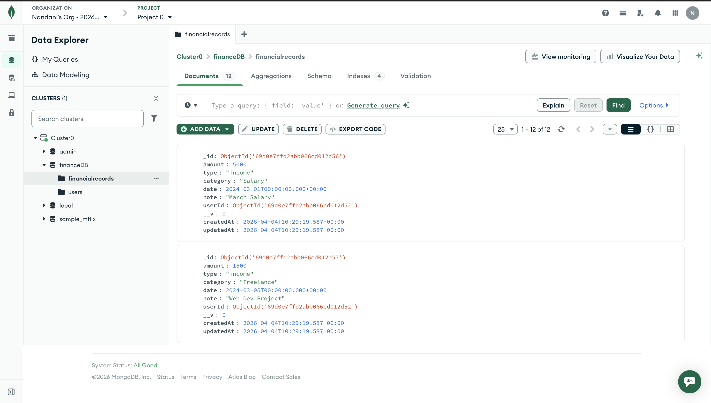
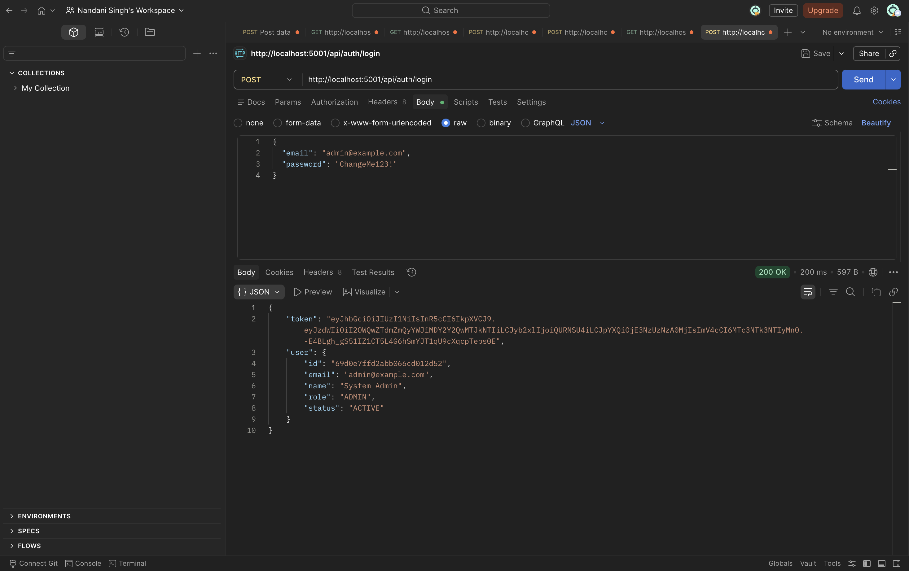
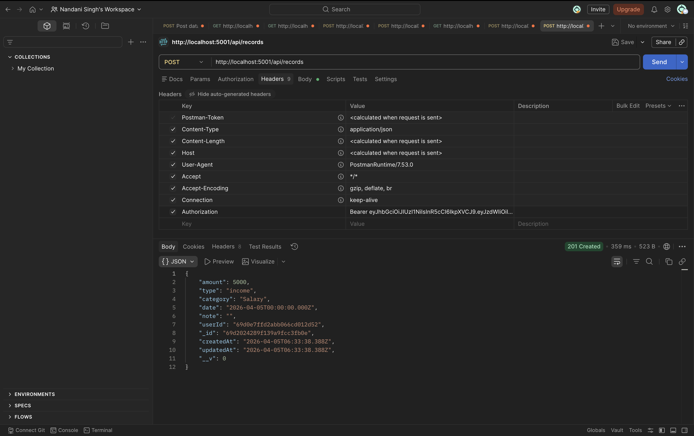
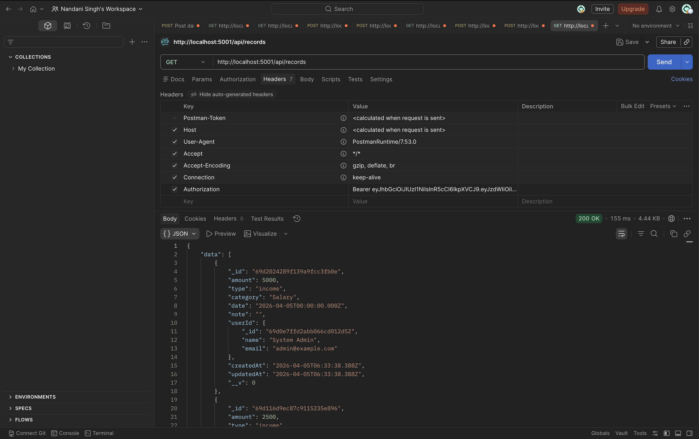
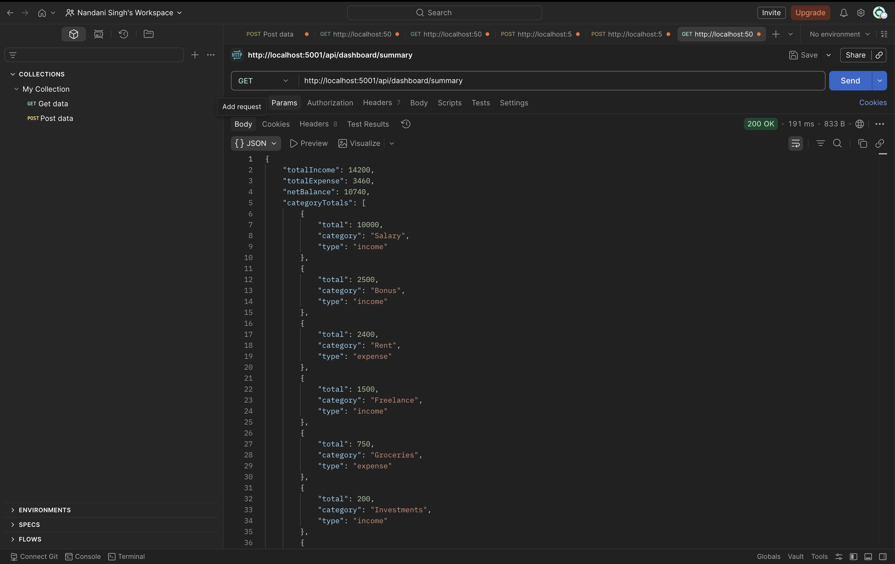

# Finance Dashboard API

Express.js backend for a finance dashboard with **MongoDB**, **JWT authentication**, and **role-based access control** (`VIEWER`, `ANALYST`, `ADMIN`).

## 🚀 Live Deployment

This project is deployed and accessible online.

- **🔗 Base URL**: `https://zorvyn-finance-dashboard-api-ozlf.onrender.com`
- **📊 Example API**: `GET https://zorvyn-finance-dashboard-api-ozlf.onrender.com/api/dashboard/summary`
- **🔐 Authentication**: Use Bearer Token in `Authorization` header.

## Stack

- Node.js, Express.js  
- MongoDB (Atlas-compatible via `MONGO_URI` or `MONGODB_URI`)  
- JWT (`jsonwebtoken`)  
- Validation: `express-validator`  
- Password hashing: `bcryptjs`

## Assumptions

- **Registration** (`POST /api/auth/register`) always creates a **VIEWER**. Admins are created via seed script or `POST /api/users` (`ADMIN` only).
- **Role access** (after JWT auth; see `src/constants/rbac.js`)
  - **VIEWER** — **read only**: dashboard aggregates (`GET /api/dashboard/summary`). No `GET /api/records`, no writes.
  - **ANALYST** — **read + dashboard**: same dashboard reads **plus** read financial records (`GET /api/records*`). No POST/PUT/DELETE on records or users.
  - **ADMIN** — **full access**: all of the above, record writes, and user management (`/api/users`).
- **Status** is `ACTIVE` or `INACTIVE`. Only `ACTIVE` users can authenticate.
- Financial records are **global** (not scoped per user), except `userId` references the `User` who created each record. All analysts/admins see the same dataset—suitable for a small team dashboard.

## Setup

1. **Node 18+** and a **MongoDB Atlas** cluster (or local MongoDB with a connection string).

2. Copy environment variables:

   ```bash
   cp .env.example .env
   ```

   Fill in:

   - `MONGO_URI` – Atlas connection string (alias: `MONGODB_URI`), including database name (e.g. `.../finance_dashboard?retryWrites=true&w=majority`).
   - `JWT_SECRET` – long random string.
   - `PORT` – optional; defaults to **5001**.

3. Install and run:

   ```bash
   npm install
   npm run seed:admin
   npm start
   ```

   Optional seed env vars: `SEED_ADMIN_EMAIL`, `SEED_ADMIN_PASSWORD` (defaults in `scripts/seedAdmin.js`).

4. Health check: `GET http://localhost:5001/health`

## API overview

| Method | Path | Auth | Roles |
|--------|------|------|--------|
| POST | `/api/auth/register` | — | — |
| POST | `/api/auth/login` | — | — |
| GET | `/api/auth/me` | JWT | any ACTIVE user |
| GET | `/api/users` | JWT | ADMIN |
| POST | `/api/users` | JWT | ADMIN |
| PATCH | `/api/users/:id` | JWT | ADMIN |
| GET | `/api/records` | JWT | ANALYST, ADMIN |
| GET | `/api/records/:id` | JWT | ANALYST, ADMIN |
| POST | `/api/records` | JWT | ADMIN |
| PUT | `/api/records/:id` | JWT | ADMIN |
| DELETE | `/api/records/:id` | JWT | ADMIN |
| GET | `/api/dashboard/summary` | JWT | VIEWER, ANALYST, ADMIN |

### Query parameters

- **Records list**: `type` (`income`|`expense`), `category`, `date` (single UTC day, ISO) **or** `from`/`to` range (not both), `page`, `limit` (max 100).
- **Dashboard summary** (`GET /api/dashboard/summary`): optional `from` / `to` ISO date range. Response: `totalIncome`, `totalExpense`, `netBalance`, `categoryTotals` (per category and type).

### Postman

1. Create requests with base URL `http://localhost:5001`.
2. **Register** `POST /api/auth/register` returns the new `user` (password is bcrypt-hashed; no JWT).
3. **Login** `POST /api/auth/login` with JSON body `{ "email", "password" }` returns `token` (JWT) and `user`.
4. Save the `token` from the login response.
5. For protected routes, set header: `Authorization: Bearer <token>`.

## Project layout

- `src/server.js` – loads `dotenv`, connects DB, listens on **port 5001** (or `PORT`).
- `src/app.js` – Express app, `cors`, `express.json`, routes, 404, error handler.
- `src/models/` – Mongoose schemas.
- `src/middleware/` – JWT auth, RBAC, validation, errors.
- `src/services/dashboardService.js` – aggregation for dashboard totals and category-wise sums.
- `src/routes/`, `src/controllers/` – HTTP layer and handlers.

## Error handling

- Validation failures: `400` with `details` from `express-validator`.
- Auth: `401` / `403` with clear messages.
- Not found: `404`; conflicts (e.g. duplicate email): `409`.

## Tradeoffs

- Single shared ledger for all records; multi-tenant orgs would add `orgId` and scope queries.
- No refresh tokens or password reset flows—intentionally minimal for the assignment.

## API Screenshots & Proof of Work

Here is the visual proof displaying our working API flow, Database connection, and Authentication security:

### 1. MongoDB Database Setup
*Shows our connection to MongoDB Atlas and the stored database records in the `financialrecords` collection.*


### 2. Login API (Authentication Proof)
*Proves successful user login and that the JWT token is being generated properly (`200 OK`).*


### 3. Add Record API (Authorization Proof)
*Proves we can parse JSON requests, handle role-based access control (using the `Bearer <token>` in the Headers tab), and successfully store a new financial record (`201 Created`).*


### 4. Get Records API
*Proves successful retrieval of private financial data once the user is authenticated.*


### 5. Dashboard Summary API
*Proves data aggregation works for generating our financial summaries dynamically.*

